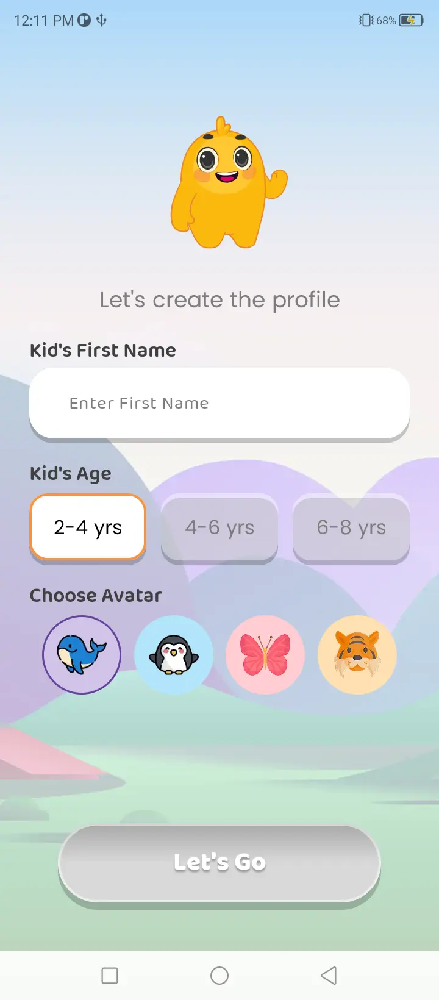
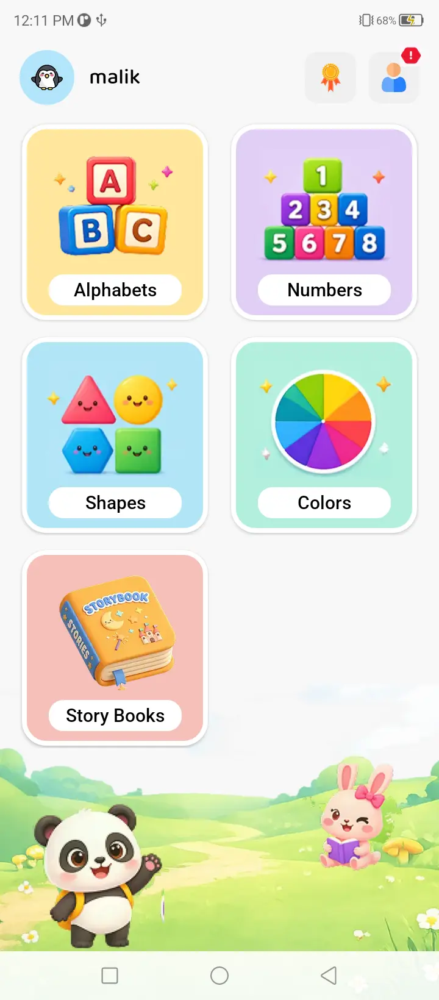
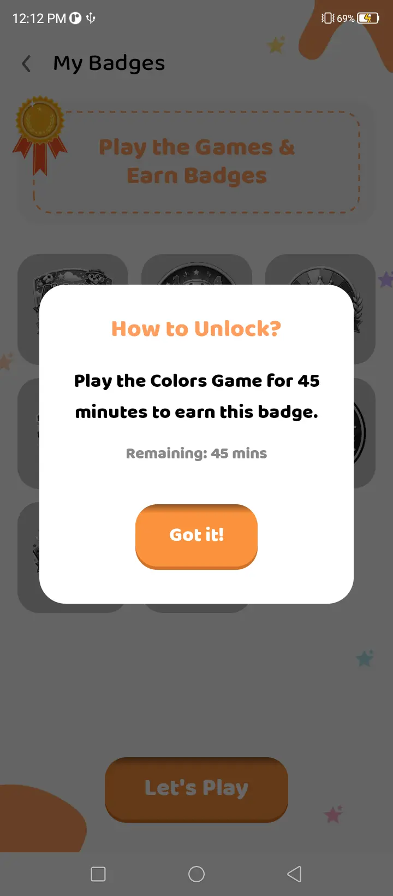
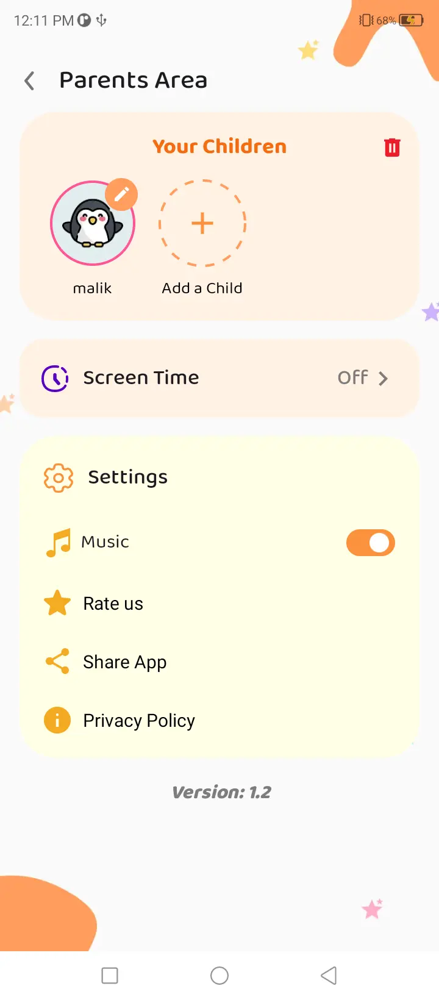
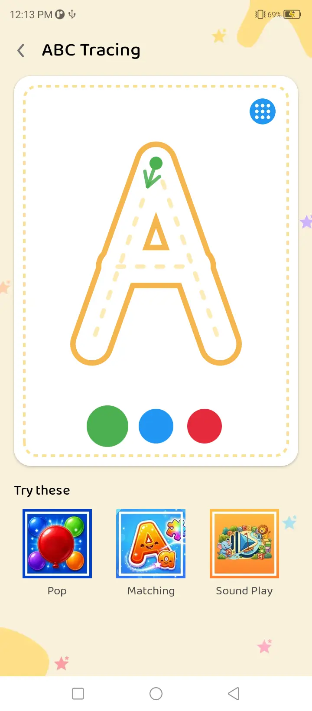
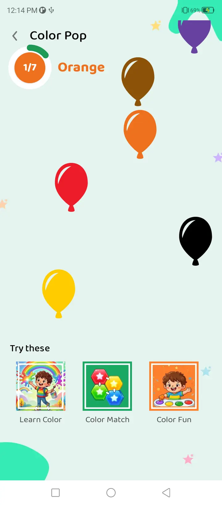
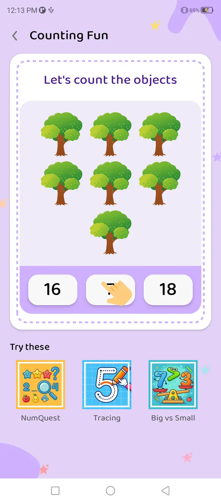
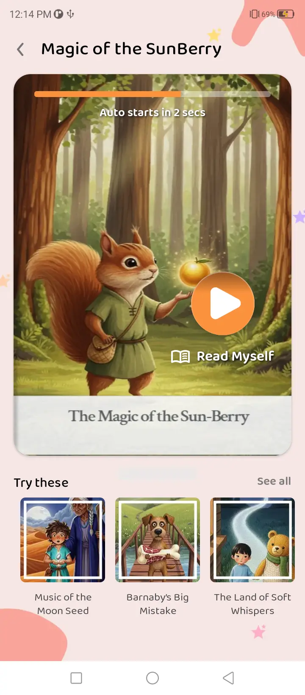
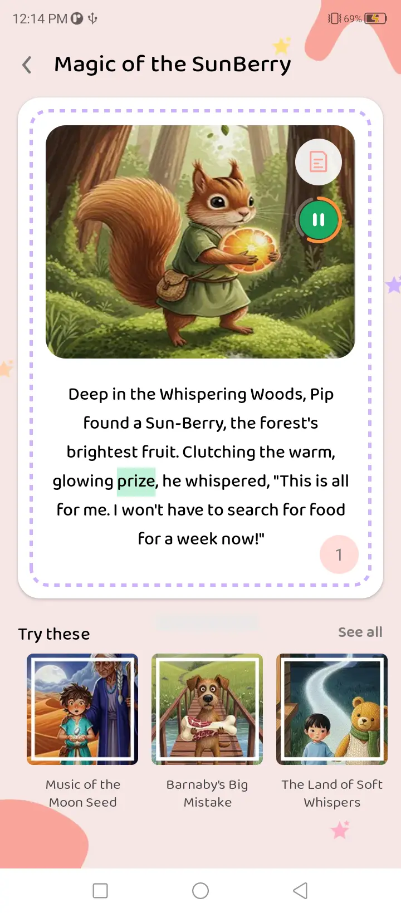

# Kidovo App

> **Note:** This is the New version of the app.

An Android Kids Learning App Game  built with Kotlin, Jetpack Compose, and modern Android architecture.

## Features

- Alphabets(Tracing, Balloon Popup,Alphabet Matching) 
- Numbers(NumQuest, Tracing, Big vs Small, Counting Fun)
- Shapes(Match up, Shape Fun, Magic Trace, Shape Hunt)
- Colors(Color Match, Color Fun, Learn Color, Color Ballon Popup)
- Story Books
- Game progress tracking
- Badges system
- Parent/User notification
- Screen Time tracking
- Limit hours/minutes
- Avatar selection
- Parent/User settings
- Add Child functionality
- 

## Screenshots

## Tech Stack

- **Language:** Kotlin
- **UI:** Jetpack Compose, Material 3
- **Architecture:** MVVM, Hilt (DI)
- **Data:** Room, DataStore
- **Speech Recognition:** Text to Speech
- **Animations:** Lottie, Animated Visibility

## Requirements

- Android Studio (latest)
- minSdk 24
- targetSdk 36

## Getting Started

1. Clone the repository
2. Open in Android Studio
3. Sync Gradle and run

